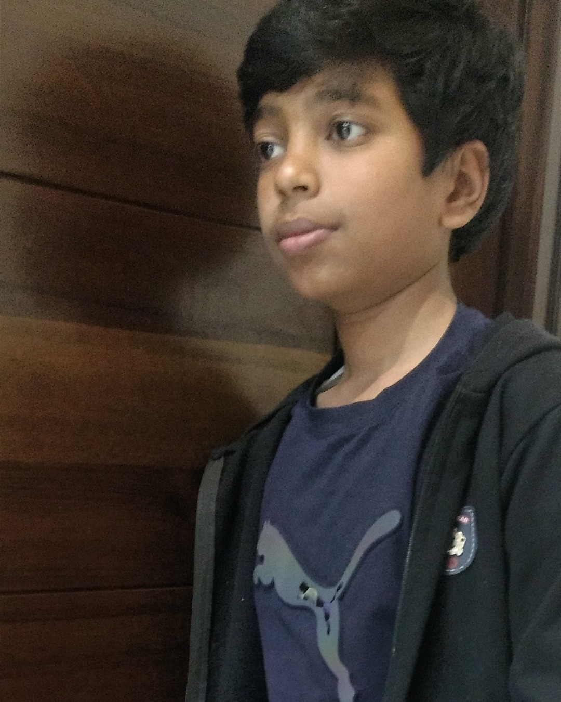
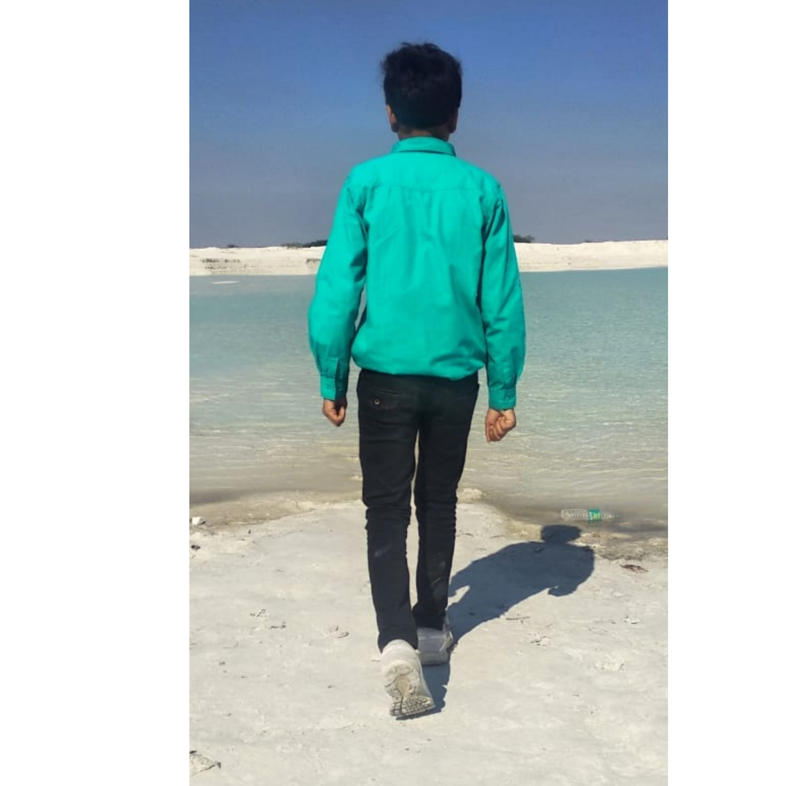
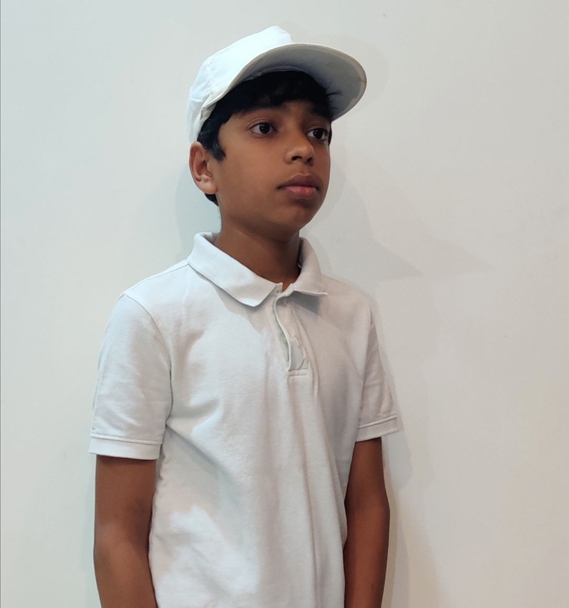
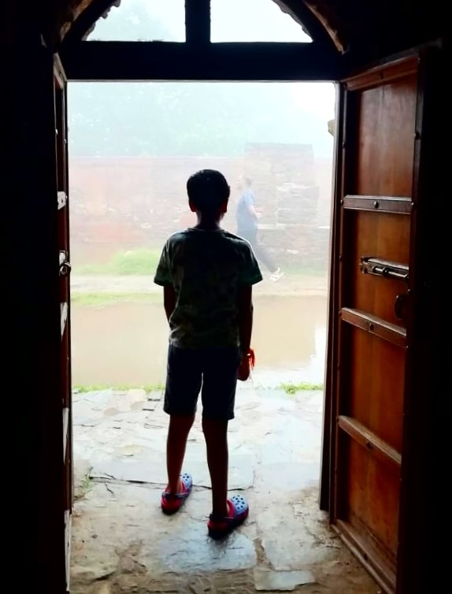
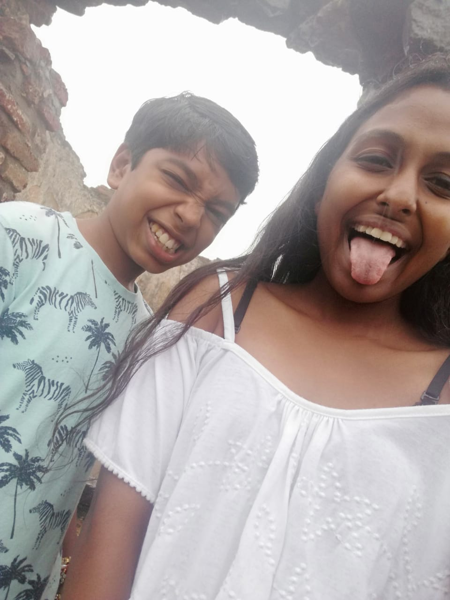
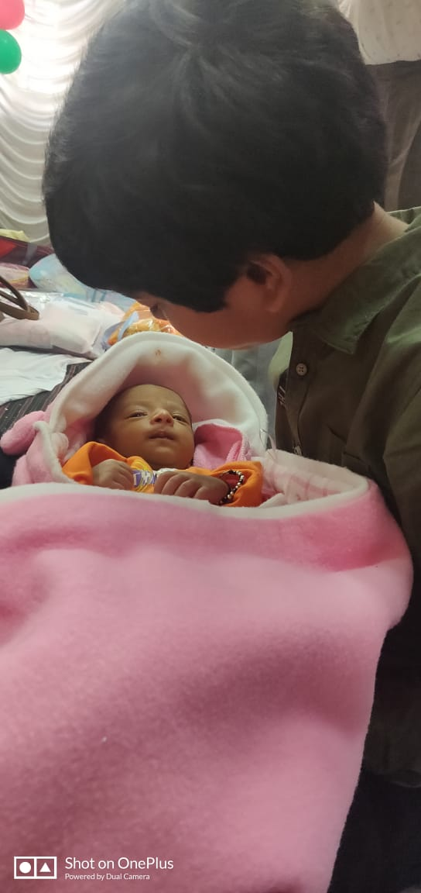

<!DOCTYPE html>

<html lang="en">
<head>
  <!-- Required meta tags -->
  <meta charset="utf-8">
  <meta name="viewport" content="width=device-width, initial-scale=1, shrink-to-fit=no">
  <link rel="stylesheet" href="assets/css/bootstrap.min.css">
  <link rel="stylesheet" href="assets/css/style.css">
  <title>Darshil Agarwal</title>
</head>

<body>
  <nav class="navbar navbar-expand-md  fixed-top maine-menu">
    

      <button class="navbar-toggler ml-auto" data-target="#my-nav" onclick="myFunction(this)" data-toggle="collapse">    </button>
      

        <ul class="navbar-nav mx-auto">
          <li class="nav-item active"> <a class="nav-link" href="#">Home</a> </li>
          <li class="nav-item"> <a class="nav-link" href="#about" tabindex="-1" aria-disabled="true">About</a></li>
          <li class="nav-item"> <a class="nav-link" href="#activity" tabindex="-1" aria-disabled="true">Activity</a></li>
          <li class="nav-item"> <a class="nav-link" href="#portfolio" tabindex="-1" aria-disabled="true">Portfolio</a></li>
          <li class="nav-item"> <a class="nav-link" href="#contact" tabindex="-1" aria-disabled="true">Contact</a></li>
        </ul>
      

    

  </nav>
  

    
 
      

        

          <h2 class="card-title">Darshil
         </h2>
         <h2 class="card-title">class Xth student
         </h2>
          <a href="#" class="btn">
            <svg width="20" height="20" viewBox="0 0 201 51">
              <defs>
                
              <linearGradient id="linear-gradient" x1="140.508" y1="50.5" x2="60.492" y2="0.5" gradientUnits="userSpaceOnUse">
                <stop offset="0" stop-color="#e90e65"/>
                <stop offset="1" stop-color="#fff"/>
              </linearGradient>
            </defs>
            <rect id="Rounded_Rectangle_1" data-name="Rounded Rectangle 1" class="cls-1" x="0.5" y="0.5" width="200" height="50" rx="25" ry="25"/>
          </svg>
        </a> 

      

    

  

  

    

      

        
 
          
 

        

      

      

        
 
          
 

        

      

    

  

  

    

      

        

          
 
            
 

          

        

        

          

            <h3>I am Darshil Agarwal</h3>
            <h4>Class Xth student</h4>
            

            
Myself Darshil Agarwal.
            	 I live in Kishangarh,Ajmer(Rajasthan).I like to play cricket. Machine learning ,watching Naruto and reading books are some of my hobbies. 
 
            <a href="#" class="btn">CONTACT</a> 

          

        

      

      

        

          <h2>Activities</h2>
          

            

              
 
                
 
                  

                    <h5 class="card-title">Learnt Python</h5>
                  

                

              

            

            

              
 
                
 
                  

                    <h5 class="card-title">learnt c++</h5>
                  

                

              

            

            

              
 
                
 
                  

                    <h5 class="card-title">worked on self</h5>
                  

                

              

            

            

              
 
                
 
                  

                    <h5 class="card-title">Read many books</h5>
                  

                

              

            

          

        

      

    

  

  

    

      <h2>Portfolios</h2>
      

        

          
 
            
 
              

                <h5 class="card-title">Historical place shots</h5>
              

            

          

        

        

          
 
            
 
              

                <h5 class="card-title">Vacation special photography</h5>
              

            

          

        

        

          
 
            
 
              

                <h5 class="card-title">Natural site</h5>
              

            

          

        

        

          

            
 
              
 
                

                  <h5 class="card-title">Lorem ipsum dolor</h5>
                

              

            

          

          

            
 
              
 
                

                  <h5 class="card-title">Lorem ipsum dolor</h5>
                

              

            

          

          

            

              
 
                
 
                  

                    <h5 class="card-title">Portraits</h5>
                  

                

              

            

            

              
 
                
 
                  

                    <h5 class="card-title">Wedding photography</h5>
                  

                

              

            

          

        

      

    

  

  

    

      

        
 
          

            <h2>family</h2>
          

        

        

          
 
            
He's Kishan Agarwal my father. He is an Buisnessman. He is wery frank, down to earth and of kind nature. 

          

        

        

          
 
            
She is Rekha Agarwal my mother. she is a housewife. She is always there for me.
             I love to spend time with her.

          

        

        

          
 
            
She is Muskan Bansal my sister, she is graduated from MBM,Jodhpur. Now she is an technical engeenier at Western Digital company. 

          

        

        

          
 
            
She is Manan Agarwal my sister. She is studing in Gargi collage,Delhi persuing Psychology.

          

        

      

      <ol class="carousel-indicators">
        <li data-target="#my-carousel" data-slide-to="0" >  Kishan Agarwal </li>

        <li class="active" data-target="#my-carousel" data-slide-to="1" aria-current="location">  Rekha Agarwal </li>

        <li class="active" data-target="#my-carousel" data-slide-to="2">  Muskan Bansal </li> 

        <li data-target="#my-carousel" data-slide-to="3" >  manan agarwal </li>
      </ol>
    

  

      <h2 class="text-center d-block">Find me on social media</h2>
      

        <ul class="nav mx-auto">
          <li class="nav-item">  </li>
          <li class="nav-item">  </li>
          <li class="nav-item">  </li>
        </ul>
      

    

  

  <footer class="container-fluid p-0 pr-0">
    

      

        <iframe src="https://maps.google.com/maps?q=26.5736774%2C74.8349426&t=&z=13&ie=UTF8&iwloc=&output=embed"style="border:0" allowfullscreen></iframe>
      

      

        

          <h3 class="text-uppercase">Contact me</h3>
          
Darshil Agarwal

          
+91-9414355273

        

      

    

    

      
<a href="https://freehtml5.co/" target="_blank"> &copy; 2020 Darshil</a>  &nbsp;  |  &nbsp; Design by  &nbsp; | &nbsp;  All rights reserved

    

  </footer>

   
   
   
   
  

</body>
</html>